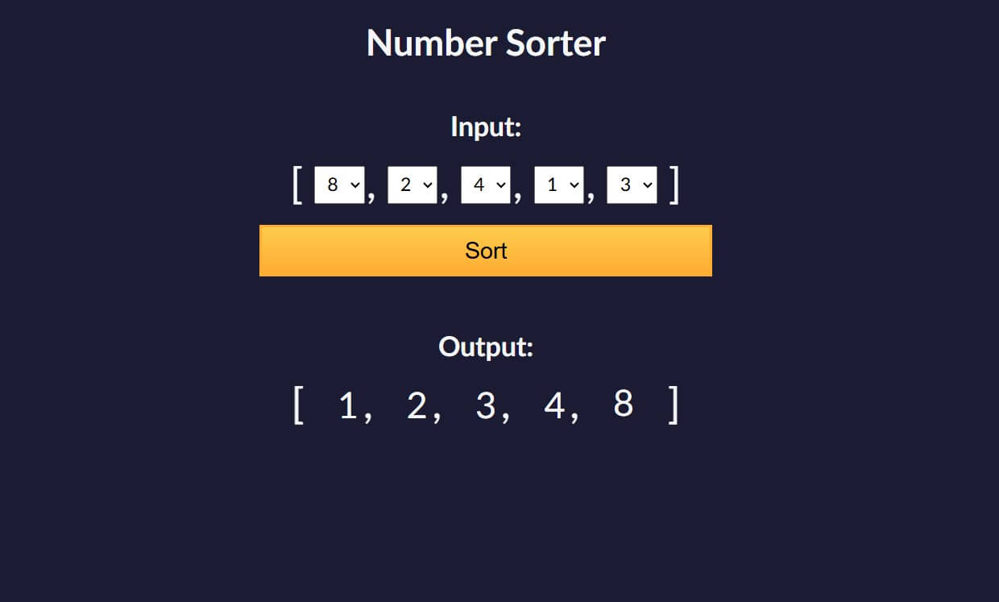

# Javascript Algorithms and Data Structures Certification
 Projects from the [Javascript Algorithms and Data Structures by freeCodeCamp](https://www.freecodecamp.org/learn/javascript-algorithms-and-data-structures-v8/).

There are two kinds of projects in this repo:

### Mini-Projects

Mini-projects are guided tutorial projects designed to teach specific concepts in JavaScript. Each mini-project includes a predefined number of steps that guide you through solving specific tasks until the project is complete. The HTML and CSS are provided, allowing the focus to remain on implementing the JavaScript logic to achieve the desired functionality.

### Main Projects (Certification Projects)

Main projects are independent certification projects that assess the ability to build applications from the ground up. Unlike mini-projects, no starter code is provided. Instead, you are given a project brief that outlines the end goal, instructions, and guidelines for ensuring the project meets the requirements for automated evaluation.

## Section 1
### Mini-Projects:

### Text-based role playing game - [Live View](https://nostrand.github.io/javascript-algorithms-data-structures-fcc/basic-rpg/index.html)
Created a simple text role playing game, to practice fundamental programming concepts.

  

### Calorie counter - [Live View](https://nostrand.github.io/javascript-algorithms-data-structures-fcc/calorie-counter/index.html)
Built a simple calorie counter web app, validated user input and performed calculations on input, dynamically updated the interface to display results.

  

### Rock, Paper, Scissors game - [Live View](https://nostrand.github.io/javascript-algorithms-data-structures-fcc/rock-paper-scissors/index.html)
Developed a simple interactive Rock, Paper, Scissors game to practice basic programming concepts using JavaScript.

  

### Music player - [Live View](https://nostrand.github.io/javascript-algorithms-data-structures-fcc/music-player/index.html)
Assembled a basic MP3 music player.

  

### Main Project - Palindrome Checker - [Live View](https://nostrand.github.io/javascript-algorithms-data-structures-fcc/project-palindrome-checker/index.html)
The goal of this project was to build a simple application that checks whether a given word is a palindrome.

  

---

## Section 2
### Mini-Projects:

### Date formatter - [Live View](https://nostrand.github.io/javascript-algorithms-data-structures-fcc/date-formatter/index.html)
I leveraged the JavaScript Date object to work with dates and customize their formatting.

  

### Football cards - [Live View](https://nostrand.github.io/javascript-algorithms-data-structures-fcc/football-cards/index.html)
Crafted football player cards applying DOM manipulation, object deestructuring, event handling and data filtering.

  

### Todo app - [Live View](https://nostrand.github.io/javascript-algorithms-data-structures-fcc/todo-app/index.html)
Handled form inputs, managed local storage, perform CRUD operations and toggle UI elements.

  

### Decimal to binary converter - [Live View](https://nostrand.github.io/javascript-algorithms-data-structures-fcc/decimal-to-binary/index.html)
Built a recursive decimal-to-binary converter, with a dynamic call stack animation for one example case.

  

---

## Section 3
### Mini-Projects:

### Simple spam filter - [Live View](https://nostrand.github.io/javascript-algorithms-data-structures-fcc/spam-filter/index.html)
A simple spam detection tool that checks user messages for common spam phrases using regular expressions. It flags messages containing keywords like "free money," "please help," or dollar amounts.

  

### Number sorter - [Live View](https://nostrand.github.io/javascript-algorithms-data-structures-fcc/number-sorter/index.html)
This mini project involves sorting an array of numbers selected from dropdowns using different sorting algorithms (Bubble Sort, Selection Sort, Insertion Sort), and the sort method, and updating the UI with the sorted values.

  

### Statistics calculator - [Live View](https://nostrand.github.io/javascript-algorithms-data-structures-fcc/statistics-calculator/index.html)
This mini project calculates key statistical values from an array of numbers entered by the user. It calculates the mean, median, mode, range, variance, and standard deviation, and displays the results on the webpage. The user inputs numbers as a comma-separated list, and the project computes and updates the statistical values dynamically using JavaScript functions.

  

### Spreadsheet - [Live View](https://nostrand.github.io/javascript-algorithms-data-structures-fcc/spreadsheet/index.html)
This project is a lightweight spreadsheet application that allows users to perform calculations, evaluate formulas, and manage data dynamically. Users can input data into cells, reference other cells in formulas, and use built-in functions such as sum, average, and median. The app supports range-based operations, custom formula evaluation, and seamless updates using JavaScript. This interactive tool is ideal for basic data management and analysis.

  

---

## Section 4
### Mini-Projects:

### Shopping cart - [Live View](https://nostrand.github.io/javascript-algorithms-data-structures-fcc/shopping-cart/index.html)
A simple shopping cart. Users can add products to the cart, view subtotal / taxes / total, and clear the cart.

  

### Simple platformer game - [Live View](https://nostrand.github.io/javascript-algorithms-data-structures-fcc/platform-game/index.html)
Created a simple platformer game, to practice OOP concepts.

  

---

## Section 5
### Mini-Projects:

### fCC Authors page - [Live View](https://nostrand.github.io/javascript-algorithms-data-structures-fcc/fcc-authors-page/index.html)
Fetched and displayed author data using fetch and Promises. Implemented dynamic DOM updates and pagination to load content in batches.

  

### fCC Forum leaderboard - [Live View](https://nostrand.github.io/javascript-algorithms-data-structures-fcc/fcc-forum-learderboard/index.html)
Fetched and displayed the latest forum posts from the freeCodeCamp community using the fetch API. Dynamically rendered post data including titles, view counts, time ago, avatars, and categories. The avatars are displayed using image URLs fetched from the FreeCodeCamp CDN, while post details are dynamically updated to show the latest activity and user interaction.

  

